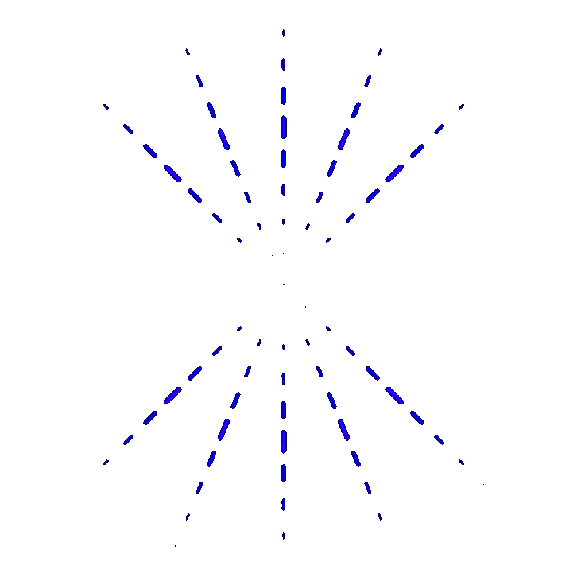
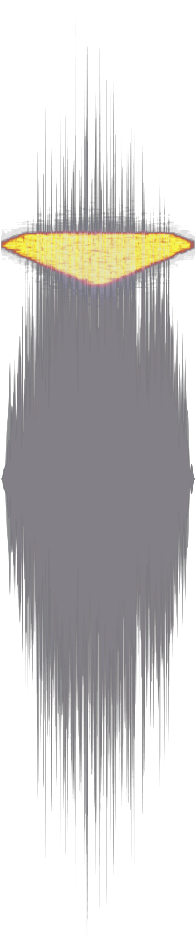

<!--img src="docs/logo.svg" width=175-->

</a>　<a href="https://shields.io/github/kubinka0505/YTMVG/blob/main/docs/notebook.ipynb"></a>　<a href="https://app.codacy.com/gh/kubinka0505/soniform">

## Description 📝
Various scripts used to convert static visual media to signals. 🎨 → 🔊

## Installation ⚙️
1. Clone the repository and move to its directory.
	```bash
	git clone https://github.com/kubinka0505/soniform
	cd soniform
	```
2. Install required modules by inputting `pip install -r requirements.txt`

---

### Scripts 🧰

<details><summary><h3><code>lissajous</code> 🪱</h3></summary>
Converts a vector shape into a Lissajous curve waveform, suitable for visualization on oscilloscopes.

<hr>

**Basic usage:**
```bash
lissajous.py -i "shape.svg"
```

**Advanced usage:**
```bash
lissajous.py -i "shape.svg" -a 0.5 -d 1.0 -r 2.0 -freq 123
```

**Basic arguments:**
* `-i`: Input SVG shape to convert.
* `-a`: Duration of the generated build-up animation (seconds).
* `-d`: Total waveform duration (seconds).
* `-r`: Fall-off duration after playback (seconds).
* `-sr`: Audio sample rate (Hz).
* `-freq`: Playback frequency (Hz).

**Preview:**
<br>

</details>


<details><summary><h3><code>wavegraph</code> 📊</h3></summary>
Traces the outline of a shape and converts it into a waveform.

Generates both a visual trace animation and a corresponding audio cycle.

<hr>

**Basic usage:**
```bash
wavegraph.py -i "shape.svg"
```

**Advanced usage:**
```bash
wavegraph.py -i "shape.svg" -f 40 -fps 30 -c #FC0 -sr 96000 -freq 220
```

**Basic arguments:**
* `-i`: Input SVG shape to trace.
* `-f`: Number of generated animation frames.
* `-fps`: Playback frame rate.
* `-c`: RGB color of the rendered waveform.
* `-sr`: Audio sample rate (Hz).
* `-freq`: Playback frequency (Hz).

**Preview:**
<br>

</details>


<details><summary><h3><code>specimg</code> 🖼️</h3></summary>
Creates a spectrogram image from the input file and produces the stereo audio signal represented by that spectrogram.

<hr>

**Basic usage:**
```bash
specimg.py -i "shape.svg"
```

**Advanced usage:**
```bash
specimg.py -i "shape.svg" -d 2 -sr 88200 -fmin 100 -fmax -1 -fm log
```

**Basic arguments:**
* `-i`: Input image to convert.
* `-d`: Duration of generated audio (seconds).
* `-sr`: Audio sample rate (Hz).
* `-fmin`: Lowest frequency included in the spectrogram (Hz).
* `-fmax`: Highest frequency included in the spectrogram (`-1` is equivalent to `-sr`).
* `-fm`: Frequency scaling mode (`log` for logarithmic scaling).

**Preview:**
<br>

</details>